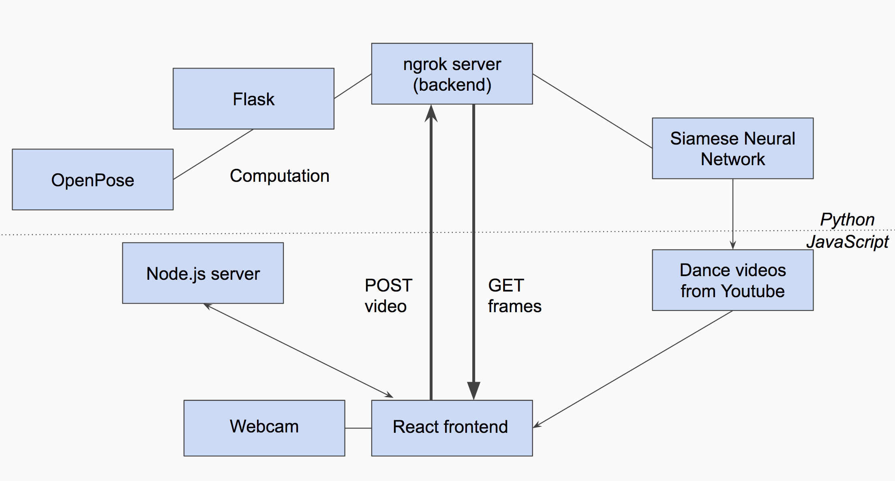

# InsDance
Have you ever had a time where you want to learn how to dance, perhaps for an upcoming performance or ball, but dance lessons are way too expensive? This application provides a personal assistant that gives you feedback based on your dance moves!

### Features
- Record a video of you dancing by pressing "Start Video"
- You may pause or resume the video anytime you like. To finish, press "Stop Video"
- "Stop Video" provides a blob for you to download, in the .webm file format. 
- "Analyze Video" analyzes your video along with the video of a professional dancer that most resembles a legitimate dance style, using data obtained from OpenPose.
- Score will show up based on how similar and how well you perform compared to the professional dancer
- A separate software, with the help of matplotlib, provides a frame by frame wire pose overlay to show the output of the OpenPose API

### Technologies Used
The general tech stack looks somewhat complicated, but the figure below should clarify what is going on in the big picture. In general, we used React, HTML, CSS, and JavaScript for the frontend, Node.js on the web app's backend, Flask and ngrok server on the other backend to perform computations of OpenPose wireframes and run the Siamese Neural Network.

This repository contains the JavaScript (frontend/some backend) portion of the project. For the Python portion of the project, refer to https://github.com/willyjlee/InsDance
